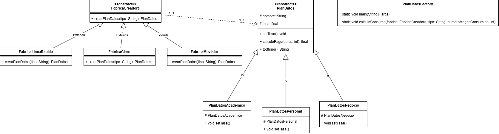
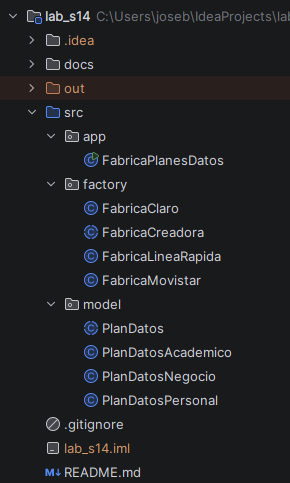
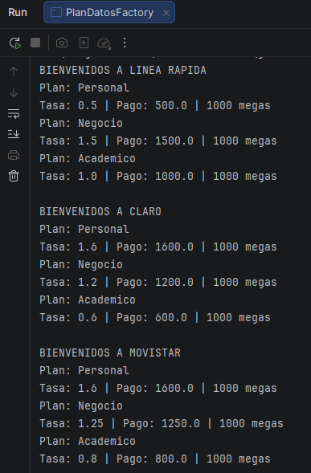

# Semana 14 - Patrones de Diseño de Software
## Patrón Factory Method - Planes de Datos

## Descripción del problema

La compañía de teléfonos **Línea Rápida** ofrece tres tipos de planes de servicio de datos: personal, negocio y académico, cada uno con una tasa de pago distinta por mega consumido.

En la segunda parte del ejercicio se agregan dos proveedores adicionales, **Claro** y **Movistar**, cada uno con sus propias tasas para los mismos tres tipos de plan. El reto es diseñar el sistema de forma que agregar un proveedor nuevo no obligue a modificar el código ya existente, solo a extenderlo.

Para esto se aplicó el patrón de diseño **Factory Method**.

## ¿Qué es Factory Method y por qué se usó?

Factory Method es un patrón creacional que delega la creación de objetos a subclases, en vez de que el cliente decida directamente con qué clase concreta trabajar (por ejemplo, evitando hacer `new PlanDatosPersonal(...)` directamente en el `main`).

En este proyecto se identificaron dos jerarquías que deben mantenerse independientes pero relacionadas:

1. **Quién crea** los planes → jerarquía de fábricas (`FabricaCreadora` y sus proveedores concretos).
2. **Qué se crea** → jerarquía de planes de datos (`PlanDatos` y sus tipos concretos).
   Cada fábrica concreta (Línea Rápida, Claro, Movistar) sabe cuáles son sus propias tasas, pero todas comparten la misma forma de crear un plan: reciben un tipo y devuelven un objeto `PlanDatos`, sin que el código cliente necesite saber la clase exacta que se instanció.

Esto permite que, si más adelante se quiere sumar un proveedor nuevo, solo se cree una fábrica concreta nueva heredando de `FabricaCreadora`, sin tocar ninguna clase ya probada. Esto es el principio de **abierto/cerrado** (Open/Closed): el sistema queda abierto a extensión, pero cerrado a modificación.

## Diagrama de clases

El diagrama muestra dos jerarquías paralelas:

- **Fábricas:** `FabricaCreadora` (abstracta) es heredada por `FabricaLineaRapida`, `FabricaClaro` y `FabricaMovistar`. Cada una implementa `crearPlanDatos(tipo)` devolviendo el plan con la tasa que le corresponde.
- **Productos:** `PlanDatos` (abstracta) es heredada por `PlanDatosAcademico`, `PlanDatosPersonal` y `PlanDatosNegocio`. Estas clases reciben la tasa por constructor, por lo que sirven para cualquier proveedor sin duplicar código.
  La relación entre ambas jerarquías se representa con una dependencia (línea punteada): toda fábrica creadora produce objetos de tipo `PlanDatos`, sin exponer la clase concreta al cliente.

## Estructura del proyecto

## Salida del programa

El programa se probó con un consumo de 1000 megas para los tres proveedores, mostrando el plan, su tasa y el pago calculado en cada caso.

## Decisiones de diseño a resaltar

- **`FabricaCreadora` es abstracta, no interfaz:** se eligió clase abstracta en vez de interfaz porque deja la puerta abierta a compartir atributos o lógica común entre las fábricas concretas más adelante (por ejemplo, validaciones), algo que una interfaz clásica no permite. Además, al ser abstracta se impide instanciarla directamente, ya que una "fábrica sin proveedor" no tiene sentido en este dominio.
- **Las clases de plan no tienen tasa fija:** `PlanDatosPersonal`, `PlanDatosNegocio` y `PlanDatosAcademico` reciben la tasa por constructor. Esto evita crear una clase distinta por cada combinación de proveedor y tipo de plan (lo que hubiera significado 9 clases en vez de 3).
- **El cliente programa contra las clases abstractas:** en el `main`, las variables se declaran como `FabricaCreadora` y `PlanDatos`, no como sus clases concretas. Esto es lo que permite que un mismo método (`calculoConsumo`) funcione para cualquier proveedor sin necesidad de sobrecargarlo.
